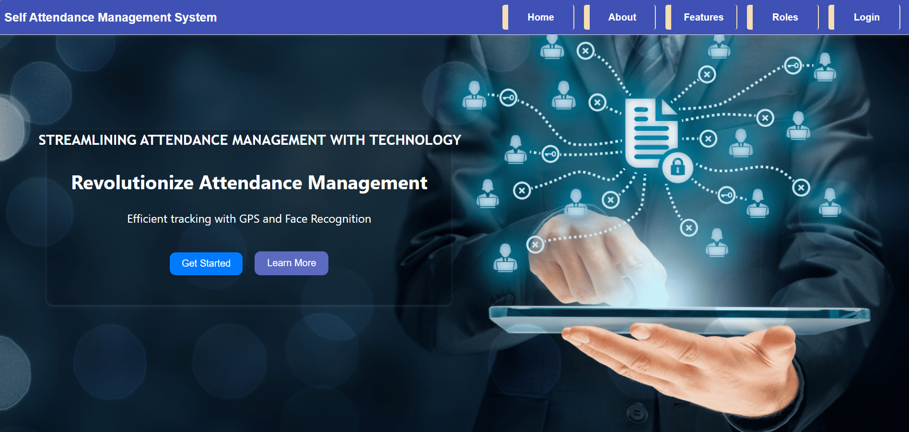
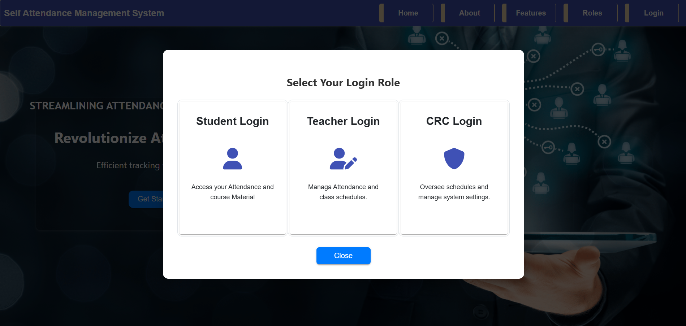

# Advanced Attendance Management System

## Overview
The **Advanced Attendance Management System** is a web-based solution designed to automate attendance tracking in educational institutions. It eliminates manual errors, prevents proxy attendance, and improves efficiency by providing real-time tracking using GPS validation.

## Features
### Role-Based Authentication
- **Super Admin Panel**
  - Manage branches, CRCs, teachers, and students.
- **CRC Panel**
  - Create and manage timetables.
  - Assign teachers to subjects.
  - Generate student attendance reports.
- **Teacher Panel**
  - View assigned subjects and schedules.
  - Mark and track student attendance.
  - Submit subject completion reports (final approval by CRC).
- **Student Panel**
  - View personal timetable.
  - Mark attendance (GPS validation to prevent proxies).
  - Single-device login restriction for security.
  - Gamification: Incentives for maintaining good attendance.
  - Assignment & Chat Panel for communication with teachers.

### Additional Features
- **Parent Notifications**: Automatic updates on student attendance.
- **Attendance Reports & Insights**: Viewable by teachers and CRC.
- **AI-based Attendance Suggestions**: Predicts attendance trends and alerts students if attendance drops below 70%.

## Problem Statement
Traditional attendance tracking methods are inefficient, prone to errors, and lack security. Paper-based or biometric attendance systems face challenges such as:
- Proxy attendance.
- Data loss and retrieval difficulties.
- Time-consuming manual processes.

Our system overcomes these limitations with a **secure, automated, and real-time attendance management system**.

## Technology Stack
- **Frontend**: Angular with NG Prime 17
- **Backend**: Django (Django REST Framework - DRF)
- **Database**: MySQL
- **Security**: JWT Authentication


## Installation Guide
### Prerequisites
- Node.js and Angular 18 CLI for the frontend.
- Python and Django for the backend.
- MySQL server for the database.

### Steps to Set Up
1. Clone the repository:
   ```sh
   git clone https://github.com/sivakumar6678/Advanced-Attendance-Management.git
   cd Advanced-Attendance-Management
   ```
2. Install frontend dependencies:
   ```sh
   cd frontend
   npm install
   ng serve
   ```
3. Set up the backend:
   ```sh
   cd backend
   pip install -r requirements.txt
   python manage.py migrate
   python manage.py createsuperuser
   python manage.py runserver
   ```
4. Configure the MySQL database in the `settings.py` file.
5. Access the application in your browser at `http://localhost:4200/`.


## Home Page


## Login Roles



## Contributing
Contributions are welcome! Please follow these steps:
1. Fork the repository.
2. Create a new branch (`feature-name`).
3. Commit changes and push to the branch.
4. Open a Pull Request for review.


